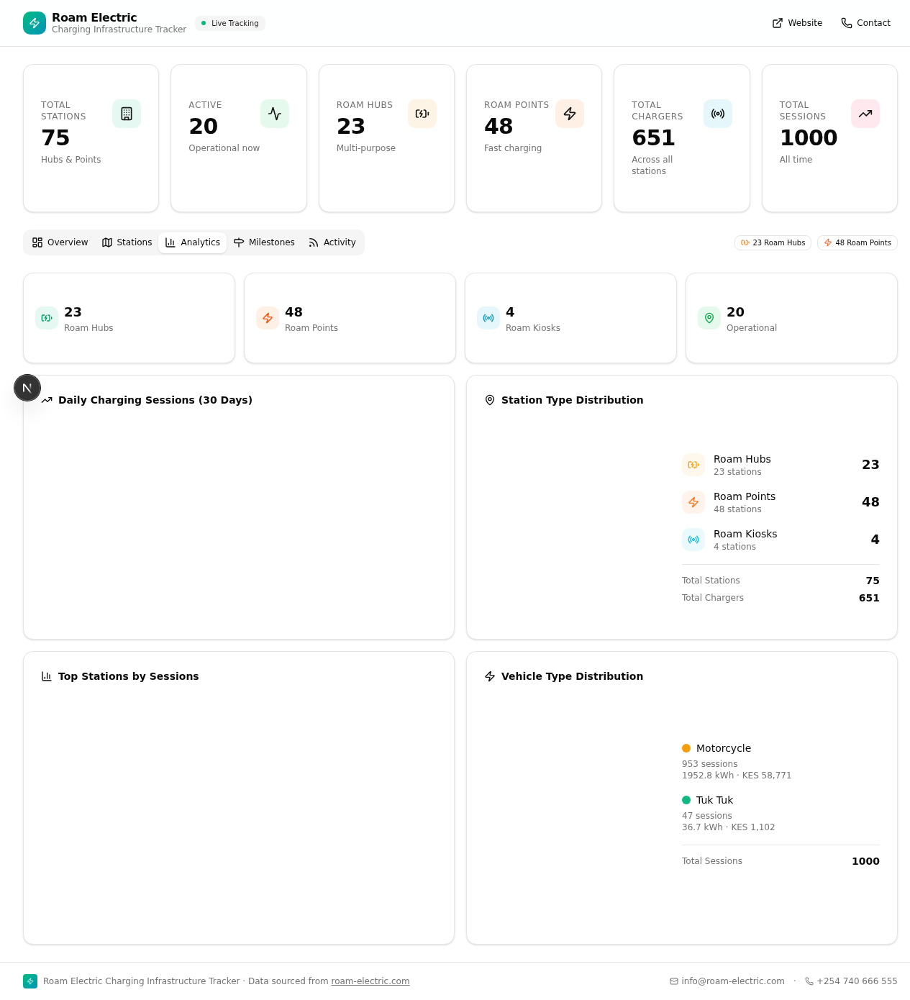

# Roam Charging Points Dashboard

A production-ready web dashboard for tracking **Roam Electric's** EV charging infrastructure across Kenya — including Roam Hubs, Roam Points, and Roam Kiosks. Built with Next.js, Prisma, and React, it provides real-time visibility into station status, analytics, milestones, and activity logs.



---

## Features

- **Interactive Map** — Visualize all charging stations on a Leaflet map with filter buttons (All, Active, Hubs, Points, Kiosks) and distinct markers per station type
- **Station Table** — Searchable, filterable table of all stations with a detail dialog per entry
- **Analytics Dashboard** — KPI summary cards, station type distribution pie chart, and top-12 stations bar chart (powered by Recharts)
- **Milestones Timeline** — Chronological view of Roam's infrastructure rollout milestones
- **Activity Feed** — Live log of recent charging events and station updates
- **Excel Auto-Sync** — Drag-and-drop Excel file upload or folder re-scan to keep dashboard data current without manual entry
- **Sync History & API** — Full sync log with status badges, counts, and duration; REST API for automated data pushes

---

## Tech Stack

| Layer | Technology |
|---|---|
| Framework | Next.js 16 (App Router, TypeScript) |
| Styling | Tailwind CSS v4, shadcn/ui, Radix UI |
| Database | SQLite via Prisma ORM |
| Authentication | NextAuth.js v4 |
| Maps | Leaflet / React-Leaflet |
| Charts | Recharts |
| Animations | Framer Motion |
| Data Fetching | TanStack React Query |
| Forms | React Hook Form + Zod |
| Package Manager | Bun |
| Reverse Proxy | Caddy |
| Deployment | Vercel |

---

## Data Model

The Prisma schema defines four core models:

- **ChargingStation** — All station types (Hub, Point, Kiosk) with coordinates, status, charger count, and partner info
- **Milestone** — Key infrastructure rollout events with dates and descriptions
- **ActivityLog** — Operational events and status changes per station
- **ChargingSession** — Individual session records used for analytics and utilization metrics
- **SyncLog** — Audit trail for all data sync operations (source, status, counts, duration)

---

## Database Stats (Seeded)

| Entity | Count |
|---|---|
| Total Stations | 75 (23 Hubs, 48 Points, 4 Kiosks) |
| Pipeline Sites | 27 |
| Total Chargers | 651 |
| Milestones | 26 |
| Charging Sessions | 1,000 |

---

## API Routes

| Method | Endpoint | Description |
|---|---|---|
| GET | `/api/stations` | List all charging stations |
| GET | `/api/stations/[id]` | Get a single station by ID |
| GET | `/api/milestones` | List all milestones |
| GET | `/api/activities` | List activity log entries |
| GET | `/api/analytics` | Aggregated analytics data |
| POST | `/api/sync/upload` | Upload an Excel file to sync data |
| POST | `/api/sync/rescan` | Re-scan the `/upload` folder |
| POST | `/api/sync/data` | Push JSON data (requires `x-api-key` header) |
| POST | `/api/sync/webhook` | Flexible webhook receiver |
| GET | `/api/sync/history` | Last 50 sync logs with summary stats |
| GET/PUT | `/api/sync/config` | Read or update sync configuration |

All API endpoints return responses under **200ms** after warm-up.

---

## Getting Started

### Prerequisites

- [Bun](https://bun.sh) v1.0+
- Node.js 18+

### Installation

```bash
# Clone the repository
git clone https://github.com/rauell1/charging-points.git
cd charging-points

# Install dependencies
bun install

# Set up the database
bun run db:push

# Seed with Roam infrastructure data
bun run db:generate
```

### Environment Variables

Create a `.env` file in the project root:

```env
# NextAuth
NEXTAUTH_URL=http://localhost:3000
NEXTAUTH_SECRET=your-secret-here

# Database
DATABASE_URL="file:./dev.db"

# Google Maps (optional, for map tiles)
NEXT_PUBLIC_GOOGLE_MAPS_API_KEY=your-key-here

# Sync API Key
SYNC_API_KEY=your-sync-api-key
```

### Development

```bash
bun run dev
```

Open [http://localhost:3000](http://localhost:3000) in your browser.

### Production Build

```bash
bun run build
bun run start
```

---

## Excel Data Sync

The dashboard supports syncing directly from Roam's operational Excel files.

**Supported formats:**
- `[ROAM] - [CHARGING] - Motorcycle Charging Sites.xlsx`
- `Roam Point Site Tracker.xlsx`
- `[ROAM] - [Field Operations KE] - Locations Database.xlsx` (sheets: RP-KE, RH-KE)

**Two sync methods:**

1. **Manual Upload** — Open the *Sync Data* dialog in the dashboard header and drag-and-drop an Excel file. A preview shows created/updated/unchanged/error counts before committing.
2. **Folder Re-scan** — Place files in the `/upload` directory and click *Re-scan Folder*. The server auto-detects sheet types and upserts records.

After sync, all dashboard tabs refresh automatically via React Query cache invalidation — no page reload needed.

**API-based push (for automation):**

```bash
curl -X POST https://your-domain.com/api/sync/data \
  -H "Content-Type: application/json" \
  -H "x-api-key: YOUR_API_KEY" \
  -d '{ "stations": [ ... ] }'
```

---

## Project Structure

```
charging-points/
├── src/
│   ├── app/            # Next.js App Router pages & API routes
│   ├── components/     # UI components (dashboard, map, charts, sync dialog)
│   └── lib/            # Utilities and Prisma client
├── prisma/
│   ├── schema.prisma   # Database schema
│   └── seed.ts         # Seed script with full Roam dataset
├── db/                 # DB utilities and sync-config.json
├── upload/             # Drop Excel files here for re-scan sync
├── download/           # Export artifacts
├── scripts/            # Utility scripts
├── examples/           # Example data and API payloads
├── public/             # Static assets
├── Caddyfile.txt       # Caddy reverse proxy config
└── vercel.json         # Vercel deployment config
```

---

## Deployment

The project is configured for **Vercel** deployment out of the box via `vercel.json`. A `Caddyfile.txt` is also included for self-hosted deployments behind a Caddy reverse proxy.

Live deployment: [charging-points-iota.vercel.app](https://charging-points-iota.vercel.app)

---

## Data Sources

Station data is sourced from:
- Roam Electric operational Excel files (internal)
- [roam-electric.com](https://roam-electric.com)
- CleanTechnica
- SEforALL

---

## License

Private repository — all rights reserved by Roam Electric.
